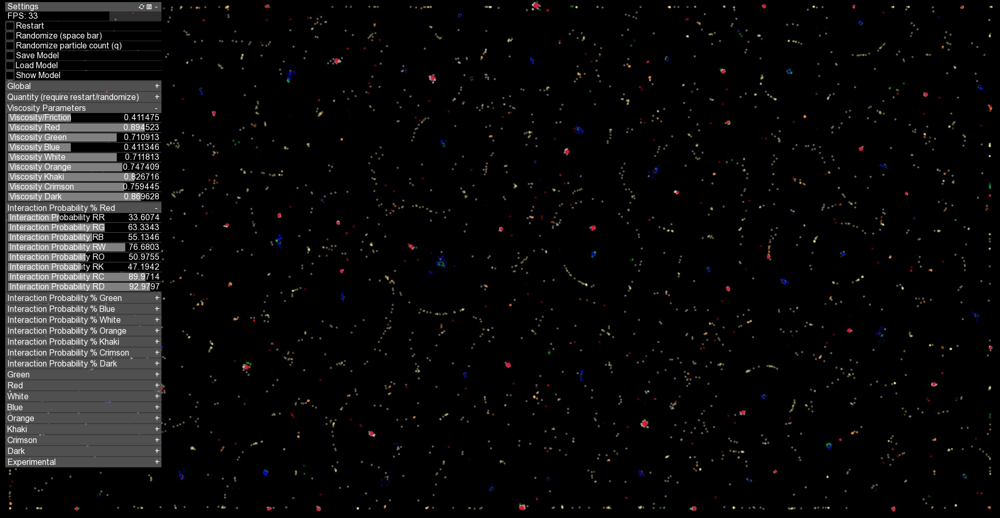
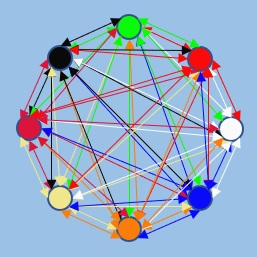
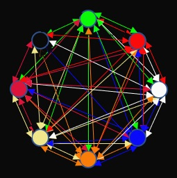
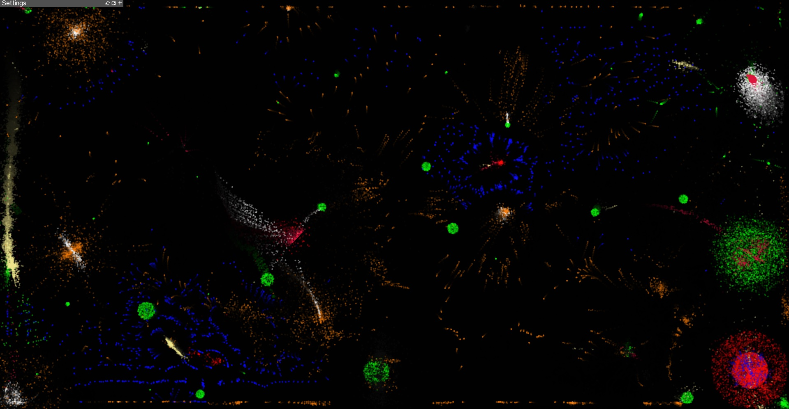
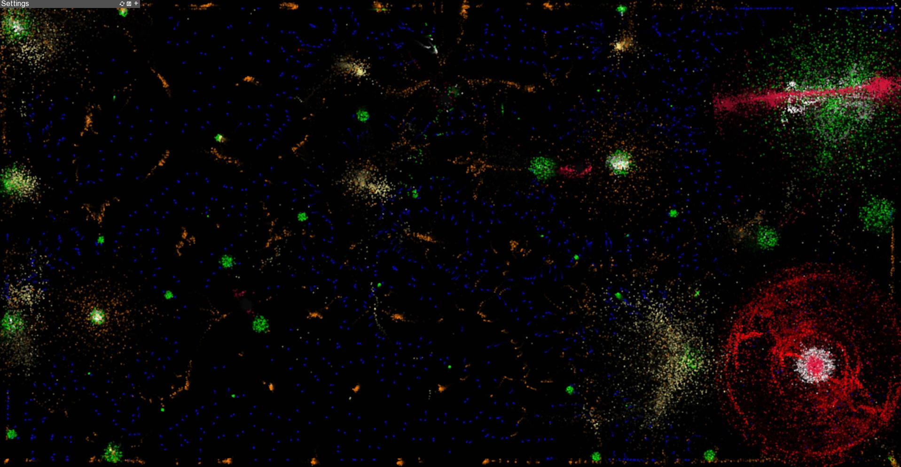
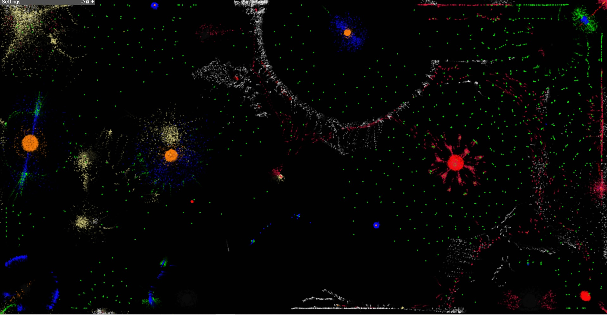
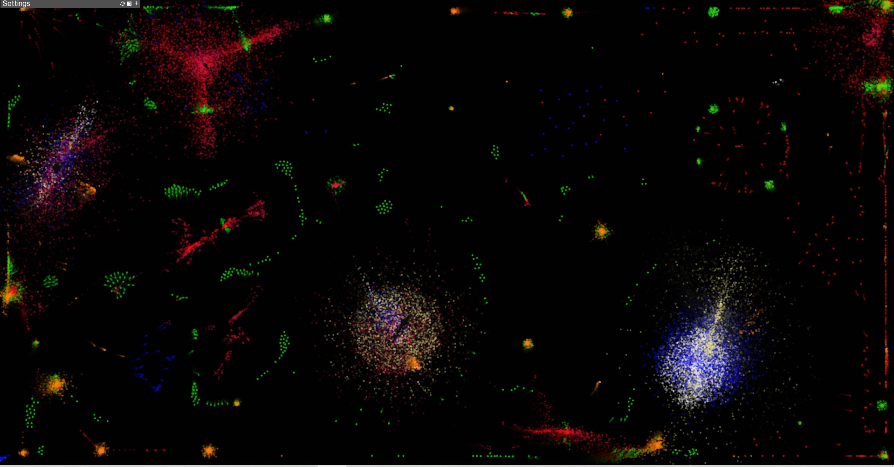
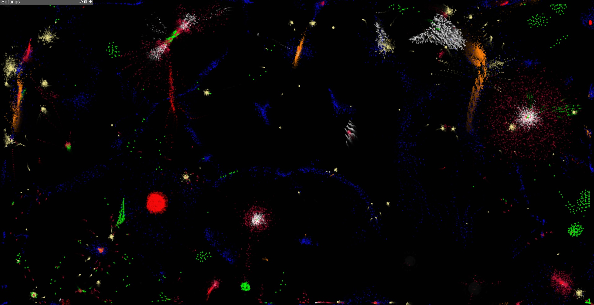
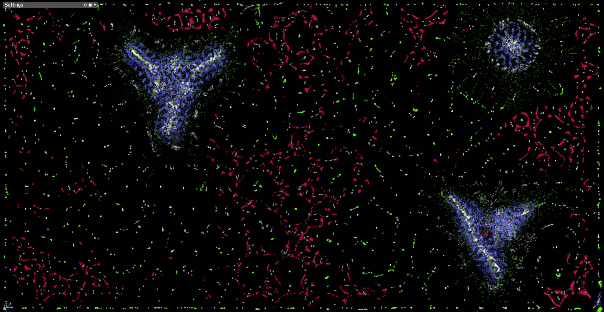
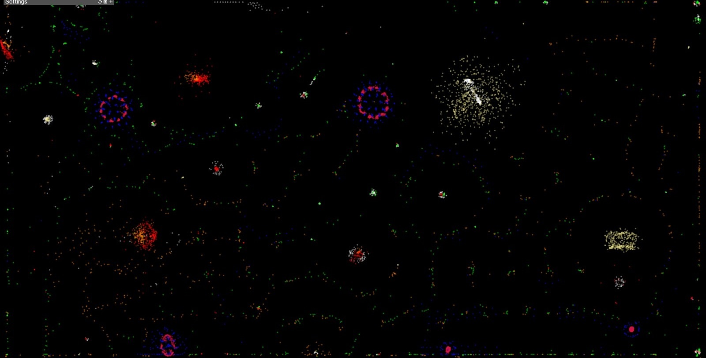

# Artificial Universe with Particle Life Simulation
A simple program to simulate Artificial Universes, with primitive Artificial Life, using simple rules of attraction and repulsion among atom-like particles, producing complex self-organzing life-like patterns.

Each particle emits a number of coloured fields of attractive and repulsive forces, depending on how many colours are defined. In the case of my version, there are 8 particle colours, so each particle will emit 16 coloured force fields: 8 attractive and 8 repulsive. Each coloured force field has its own intensity and range of action.

Each coloured particle reacts only to the field of the same colour as itself.

The eighth colour is black. This is so that the black particles are camouflaged by the background which is also black. These black particles simulate dark matter.

Every color interaction has its own viscosity. Being 64 color interactions there will be 64 viscosity parameters.

Every interaction between two colours has a certain probability of happening. Since there are 64 colours color interactions there will be 64 probability parameters.

Each parameter evolves with a certain probability and percentage, set by the user.

There are 5 types of randomizations: the number of particles per color, the interaction strengths (intensity and radius) between colors, the probabilities of interactions, the viscosity of colors and all these parameters together.

The video tutorial and walkthrough are available below.

Learn More Here (YouTube video tutorial):
-----------------------------------------------
https://youtu.be/0Kx4Y9TVMGg

Some Examples Are Here (YouTube videos):
-----------------------------------------------
https://youtu.be/97d9fkjQXFQ
-----------------------------------------------
https://youtu.be/b-afHvgact0
-----------------------------------------------
https://youtu.be/5G5Bnc5s7Kg
-----------------------------------------------
https://youtu.be/3rGuQ2XCYvc

Online Demo (JavaScript version):
-------------
Click here for a live demo of original code (JavaScript): 
  - 2d - https://hunar4321.github.io/particle-life/particle_life.html
  - 3d - https://hunar4321.github.io/particle-life/particle_life_3d.html
  
-----------------------------------------------  
Click here for a live demo of my modified code (JavaScript):
  - 2d - https://khadraswellun.github.io/particle-life/particle_life.html

I modified the maximum number of color to 12, I add randomization of all interaction force ranges (they never stay at 80 anymore). This link works on Smart TVs as well as mobile phones that have access to an internet browser. 

Interface (C++ version)
--------------------------------------------------------

--------------------------------------------------------
Interaction model

 

--------------------------------------------------------
Example Results
--------------------------------------------------------

-----------------------------------------------

-----------------------------------------------

-----------------------------------------------

-----------------------------------------------

-----------------------------------------------

-----------------------------------------------

-----------------------------------------------

Some Interesting Patterns to Reproduce:
-------------------------------------
You do not need to be exact with the parameters to reproduce these patterns. The best way to get interesting patterns is to first try random parameter explorations, once you find an interesting pattern, try fine-tuning it gradually. To avoid becoming stuck at a local maximum, you can make some occasional big parameter jumps. In this way interesting and different patterns shall keep poping up.

-----------------------------------------------

To use:
-------------
Download this repo. unzip the file then go to /particle_life/bin/ folder and click on particle_life.exe

Code:
----------------
The source code is available in C++, JavaScript, and Python.

Use this youtube channel to see more: https://www.youtube.com/channel/UCfpUYnmGctDK4Ep-nA6GYPw

To start, download this repository then download openFrameworks library from here: https://openframeworks.cc/. Use openFramework's projectGenerator and import /particle_life/ folder to the project.

Alternatively, generate a new openFramework project and add ofxGui. Once the project files are generated replace the /src/ folder with the one provided here.

You can now compile the C++ code on your machine.

Other Ports:
-------------
- [Godot](https://github.com/NiclasEriksen/game-of-leif)
- [Rust](https://github.com/ChevyRay/smarticles)
- [Go-1](https://github.com/sikora507/go-artificial-life), [Go-2](https://github.com/fglo/particles-rules-of-attraction), [Go-3](https://github.com/youssefboulmalf/Particle-Life-Go)
- [Python](https://github.com/gianfa/pyrticleslife)
- [Lua](https://github.com/ravener/love-life)
- [QB64-PE](https://github.com/a740g/Particle-Life)
- [Webgl](https://github.com/CapsAdmin/webgl-particles)
- [Java](https://github.com/helloimalemur/ParticleSimulation)
- [C# Winforms](https://github.com/BlinkSun/ParticleLifeSimulation)
- [FreeBasic](https://www.freebasic.net/forum/viewtopic.php?p=294331#p294331)

My Todos:
--------------------
1. Introducing into the interactions between any two colours both the attractive force and the repulsive force, each with its intensity and range acting simultaneously (it is now either attractive or repulsive force).
2. Ability to add more particle types (currently it is fixed to eight particle types).
3. Adding the mass parameter for each particle type.
4. Addition of particle reactivity. When two or more particles touch, there is a probability that some will change colour. This change is done according to a user-defined reactivity table.
5. Addition of antiparticles, which have negative mass and annihilate on contact with positive mass particles. These will be generated from reactions between normal particles.
6. Adding metaball. A metaball consists of two or more particles that touch and remain connected for a user-defined minimum time. The metaball will exert an attractive and a repulsive force, calculated according to a certain algorithm and depending on the component particles, and an electric charge as a force resulting from the composition of the internal coloured forces. 
7. Adding a thermal view option, whereby kinetic energy can be viewed through a specific colour spectrum.
8. (done) Linking each type of interaction to a probability parameter. Thus, no general probability will apply to all interactions between particles, but each type will have its own probability.
9. Add the ability to zoom, take screenshots and record video.
10. (done) Addition of a specific viscosity to each color interaction (possibility of creating superfluids).

